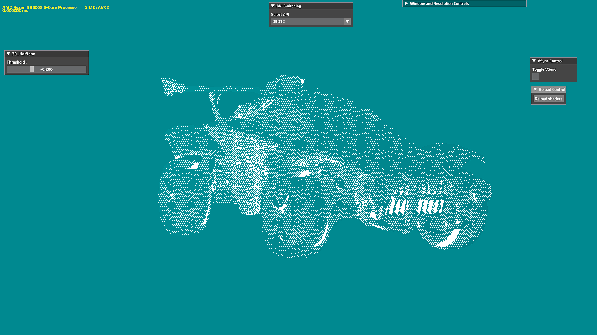
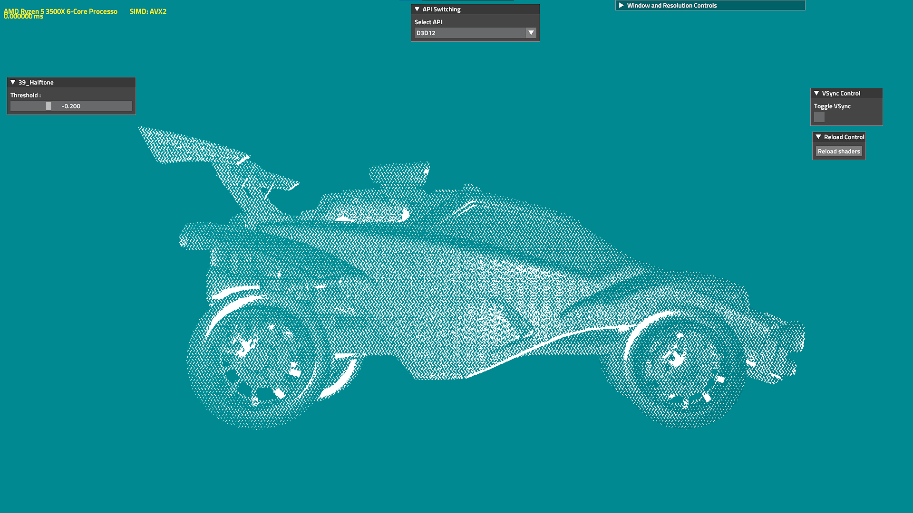
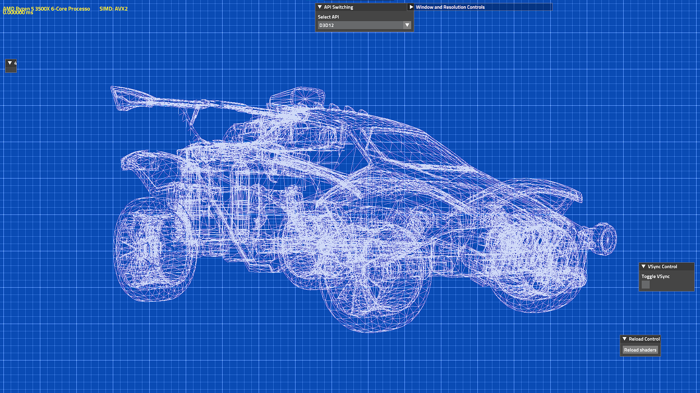
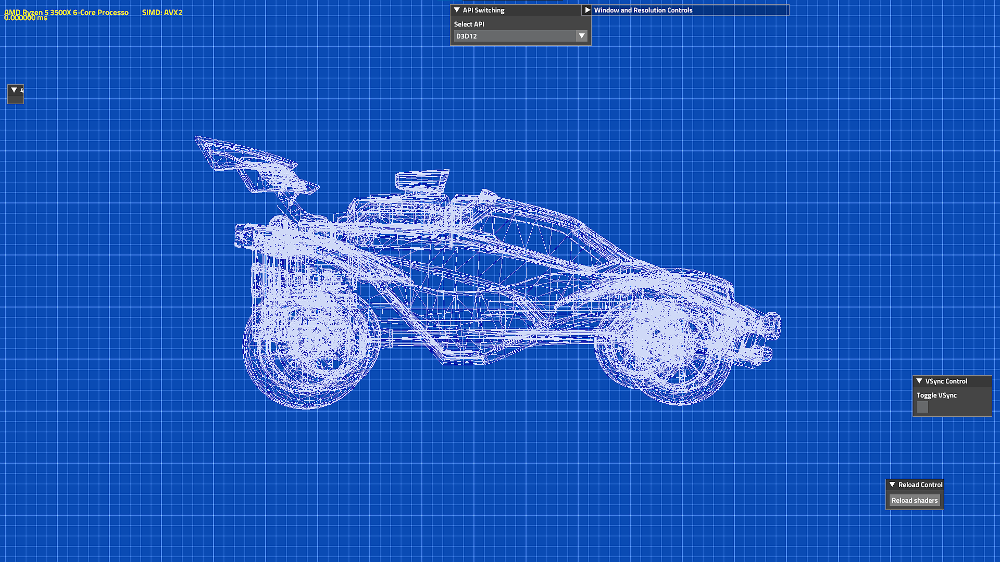
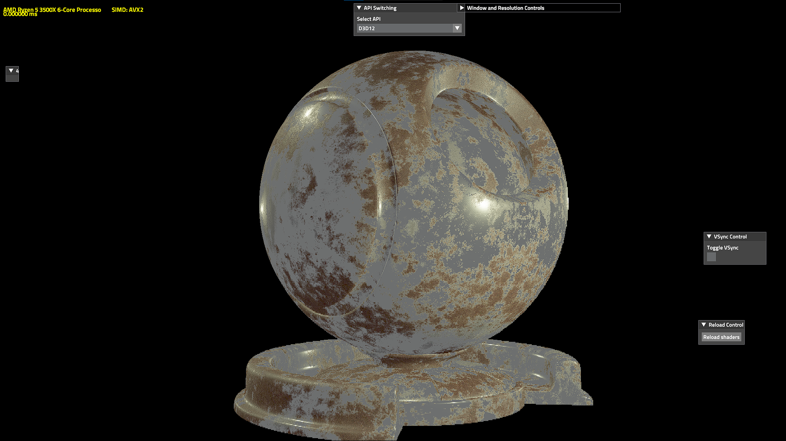
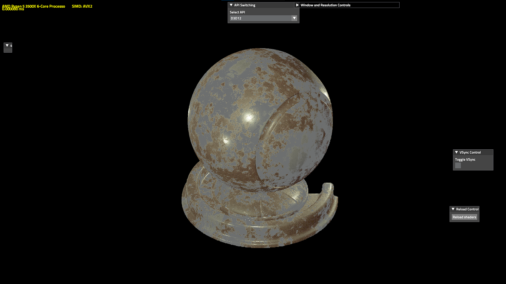

# Graphics experiments

### This is a collection of some graphics experiments written as unit tests for The-Forge.

## 39_Halftone
A simple halftone shader applied to the iconic Rocket League Octane.

## 40_Blueprint
A blueprint effect using wireframe rendering.

## 41_DeferredPBR
A Deferred Physically Based Rendering test using a tightly packed G-Buffer.
The G-Buffer is 64 bits per pixel so around 16 MBs for 1920x1080 resolutions.
The buffer format is R32G32 with the following scheme:
 - Albedo: 24 bits (8 per color channel)
 - Metallic and Roughness: 8 bits (4 per channel)
 - Depth: 16 bits (needed to reconstruct world positions)
 - Normals: 16 bits (packed using octahedral encoding, 8 bits per component)

